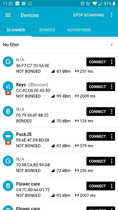
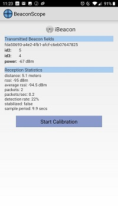

It can be a challenge to troubleshoot problems with tracking a beacon, as the problem can exist in different places in the "information pipeline." The flow of information can be visualized in the following way:


1. Beacon broadcasts an advertisement packet.
2. ESP32 collects the broadcast (green arrow)
3. ESP32 verifies connection to WiFi (orange arrow)
4. ESP32 verifies connection to MQTT (yellow arrow)
5. MQTT publishes data to `espresense` topic (purple arrow)
6. Home Assistant parses information and reports configured sensorsiot

## Logging

There are various logs that can help identify the step in the information flow that is the broken link in the chain. If you're submitting an issue, be sure to include the logs that show the problematic behaviour

### ESP32 via Serial

Your ESP32 will attempt to connect to the wireless network you specified in your configuration file. While disconnected, the on-board status LED (if available) should be lit, in addition to the power LED (which is always on when the ESP32 is powered up).

You can connect to your ESP32 over a USB cable and open a serial monitor.

There are quite a few ways to get a terminal:

* [Web Terminal](/terminal) **EASIEST**
* [PlatformIO](https://diyprojects.io/install-ide-platformio-extension-visual-studio-code-vscode-windows-32-bit-linux/)
* [Arduino IDE](https://www.arduino.cc/en/Tutorial/getting-started-with-ide-v2/ide-v2-serial-monitor)
* [Putty on Windows](https://www.techwalla.com/articles/how-to-use-putty-for-a-serial-connection#:~:text=PuTTY%20is%20an%20open%20source,similar%20servers%20for%20remote%20administration.&text=PuTTY%20also%20enables%20you%20to,device%20and%20displaying%20the%20reply.)
* [minicom on OS X](https://pbxbook.com/other/mac-tty.html)

Reset the device (using the on-board reset button), and watch the messages that are logged. You should see a message indicating that it connected to your WiFi, and the IP address it has been assigned.

```terminal
Connecting to WiFi SSID MyNetwork.....192.168.128.132
Version:     v1.1.0-beta4
IP address:  192.168.128.132
DNS address: 192.168.128.9
Hostname:    espresense-dining
Room:        dining
Telemetry:   enabled
Rooms:       enabled
Devices:     enabled
Max Distance: 16
Connecting to MQTT mqtt.mynetwork.org 1883
0 New   | MAC: d0034b0fee27, ID: apple:1005:9-12
0 New   | MAC: 640331c80302, ID: apple:1005:9-4
0 New   | MAC: 6d16f962b561, ID: apple:1002:6-12
```

If your device won't connect to your wireless network, copy and paste any logs you see into your issue.

### ESP32 MQTT

To report devices, the ESP32 must be connected to your MQTT server. It will attempt to connect once it has established a connection to your wireless network. Once connected, the device will publish a status message ("available") to the `espresense/rooms/<room>/status` topic. It also publishes your configuration information to the `espresense/rooms/<room>/telemetry` topic which consists of:


* **IP**: the assigned IP address of the device
* **Uptime**: the uptime of the node in seconds
* **Firm**: the flavor of the firmware
* **Rssi**: the wifi rssi
* **Ver**: the version of the firmware
* **Seen**: the total number of devices seen
* **Adverts**: the number of device advertisements seen in the last scan
* **Reported**: the number of devices reported in the last scan
* **FreeHeap**: the current size of free heap memory (esp_get_free_heap_size())
* **MinFreeHeap**: the minimum size of free heap memory that was available during program execution (heap_caps_get_minimum_free_size(MALLOC_CAP_INTERNAL))
* **MaxAllocHeap**: largest block of heap that can be allocated at once (heap_caps_get_largest_free_block(MALLOC_CAP_INTERNAL))
* **ResetReason**: the reason for the last reset

If you do not see any information being published to either the status or telemetry topics then you will want to connect to the serial monitor and check the logs. Verify that your MQTT user name and password is correct, and check the logs on your MQTT server itself. You should see it reporting a new client connected from the ESP32's IP address:

```terminal
New client connected from 192.168.1.104 as esp32_d (c1, k60, u'my_mqtt_username').
```

### Debug BTLE Advertisements

To view the advertisements coming from your beacon, you can use an App on a BLE-enabled device. One is [NRF Connect](https://play.google.com/store/apps/details?id=no.nordicsemi.android.mcp) for Android to view all advertised devices in your area. Once you've found the device you're interested in, you can use [Beacon Scope](https://play.google.com/store/apps/details?id=com.davidgyoungtech.beaconscanner) to connect to and view information about your beacon, which can help in determining the correct setup.





If you do not see your device advertising, then you know that the problem lies in your beacon device itself, rather than with this project.

On MacOS X you can use [Bluetility](https://github.com/jnross/Bluetility)

### Home Assistant

To view what devices are being reported on the MQTT topic, you can use a tool such as [mosquitto_sub](https://mosquitto.org/man/mosquitto_sub-1.html) to connect to and view what is being reported. This will provide you with the data format you'll need to follow when writing the configuration:

```terminal
mosquitto_sub -h <mqtt server IP address> -u <my mqtt user> -P <my mqtt password> -i presence-information -v -t "room_presence/#" | ts
```

### Query

The newest version allows you to selectively decide which ids you want queried to improve the id.  You can now put "apple:1005:9-12" in the query box and it'll ask the phone for it's model and turn it into "apple:13-3".  BUT if apple:1005:9-12 is working for you reliably it's better just to use that and keep query empty.  The ESP32 has to stop listening while sending out the queries which hurts the reliability of receiving advertisements from devices.

### Reboot loops

If mqtt stays disconnected after many tries the device will reboot.  If Wifi is disconnected it will reboot as well, and go into the Wifi Portal.  The Wifi Portal will stay up for 30 seconds and then reboot and it'll try it all over again

## Info on fingerprinting Apple devices

- https://github.com/furiousMAC/continuity
- https://i.blackhat.com/eu-19/Thursday/eu-19-Yen-Trust-In-Apples-Secret-Garden-Exploring-Reversing-Apples-Continuity-Protocol-3.pdf
- https://petsymposium.org/2020/files/papers/issue1/popets-2020-0003.pdf
- https://arxiv.org/pdf/1703.02874.pdf
- https://samteplov.com/uploads/shmoocon20/slides.pdf

